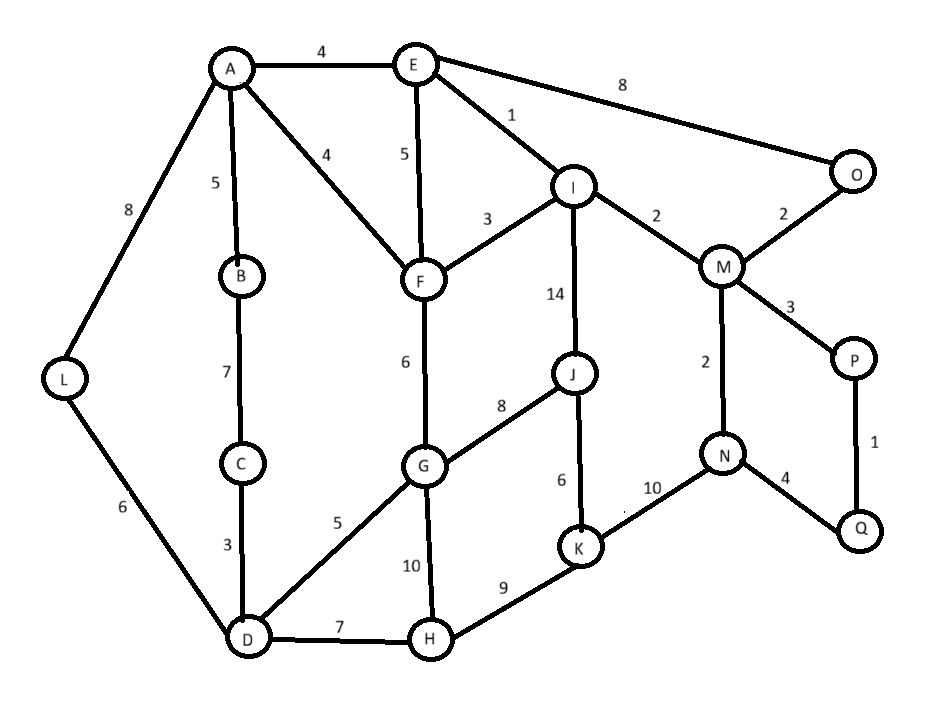

#  Fuzzy-Genetic Optimized Vehicle Routing

A hybrid AI system that finds the "smartest" and safest route for emergency vehicles—not just the "shortest" one.

This interactive tool demonstrates how a combination of Fuzzy Logic and a Genetic Algorithm can find optimal paths in a dynamic environment where road conditions like traffic, weather, and quality are constantly changing.

---

## Table of Contents
* [The Problem: "Shortest" vs. "Smartest"](#-the-problem-shortest-vs-smartest)
* [Our Solution: A Hybrid Intelligence](#-our-solution-a-hybrid-intelligence)
* [The City Map](#-the-city-map)
* [Technologies Used](#-technologies-used)
* [Installation & Setup](#-installation--setup)
* [How to Run the Project](#️-how-to-run-the-project)
* [How to Use: The "What-If" Analysis Tool](#-how-to-use-the-what-if-analysis-tool)
* [Example Demo: The "A-to-P" High-Risk Scenario](#-example-demo-the-a-to-p-high-risk-scenario)
* [Project Structure](#-project-structure)

---

## The Problem: "Shortest" vs. "Smartest"

Traditional routing algorithms, like the Dijkstra's algorithm used in many GPS systems, are excellent at finding the path with the **shortest physical distance**.

But what if that "shortest" path is gridlocked? Or has terrible road quality from construction? For an ambulance or fire truck, a delay of just a few minutes can be critical. The shortest path is often not the fastest or safest.

This project tackles this problem by building a system that can reason about a complex, dynamic environment to find the **"smartest" path** with the lowest overall risk.


---

## Our Solution: A Hybrid Intelligence

We solve this problem by combining two powerful AI techniques to create a system that is both **smart** and **fast**.

### 1. Fuzzy Logic (The "Expert Brain")
* **What it does:** It handles the real-world uncertainty of road conditions. Instead of needing exact numbers, it can reason about vague, human-like concepts.
* **How it works:** We feed it crisp data (e.g., `traffic = 85.0`, `weather = 3.0`), and it uses a set of IF-THEN rules (like `IF traffic IS 'high' OR road_quality IS 'poor' THEN risk IS 'high'`) to produce a single, intelligent **`Segment_Risk`** score.


### 2. Genetic Algorithm (The "Optimizer")
* **What it does:** It acts as a powerful search engine to explore the millions of possible routes on the map.
* **How it works:** It mimics "survival of the fittest." A population of random routes is "evolved" over many generations. Routes with a lower **total fuzzy risk** (as calculated by our "Expert Brain") are more likely to "survive" and "reproduce," creating new, better routes. This process quickly converges on an optimal path that avoids high-risk areas.


---

## The City Map

The entire simulation runs on a fixed, 17-node city map based on the graph below. The number on each edge represents its fixed **physical distance**.



---

## Technologies Used
* **Python 3.11**
* **scikit-fuzzy (`skfuzzy`):** For implementing the Fuzzy Logic Inference System.
* **NetworkX:** For creating, managing, and analyzing the city graph.
* **NumPy:** For all numerical operations and managing the risk matrix.
* **Matplotlib:** For visualizing the graph, risk matrix, and final routes.

---

## Installation & Setup

1.  **Clone the repository:**
    ```bash
    git clone [https://github.com/your-username/FuzzyGA_Routing.git](https://github.com/your-username/FuzzyGA_Routing.git)
    cd FuzzyGA_Routing
    ```

2.  **Create and activate a virtual environment (Recommended):**
    ```bash
    # Windows
    python -m venv venv
    .\venv\Scripts\activate
    
    # macOS / Linux
    python3 -m venv venv
    source venv/bin/activate
    ```

3.  **Install the required packages:**
    (This assumes you have a `requirements.txt` file in your root folder).
    ```bash
    pip install -r requirements.txt
    ```
    *If you don't have a `requirements.txt`, you can install them manually:*
    ```bash
    pip install networkx matplotlib numpy scikit-fuzzy
    ```

---

## How to Run the Project

Running the project is a two-step process.

### Step 1: Build the Graph (Run Once)
You must first run the `graph_builder.py` script. This will read the static map data and save it to a `graph_data.json` file. **You only need to do this one time.**

```bash
# From the project's root folder:
cd src
python graph_builder.py
```

### Step 2: Run the Main Program
Once the .json file exists, you can run the main interactive tool.

```Bash
# From the project's src folder:
python main.py
```

## How to Use: The "What-If" Analysis Tool

The program is a fully interactive "what-if" tool. It will guide you through the following prompts:

1.  **Select Start Node:** Enter the letter of the node where you want the journey to begin (e.g., `A`).

2.  **Select End Node:** Enter the letter of the destination node (e.g., `P`).

3.  **Build Your Scenario:** The tool will then ask you to create a custom "what-if" scenario by modifying the "perfect" road conditions.

    - It will ask how many roads have changed `traffic`, `weather`, and `road_quality`.

    - For each change, you will enter the road (e.g., `E-I`) and the new condition (`high`, `medium`, `low`, etc.).

The program will then run the full simulation based on the custom problems you created.

## Example Demo: The "A-to-P" High-Risk Scenario

The project has a built-in demo. To run it, simply choose `A` as the Start Node and `P` as the End Node.

1.  **The "Normal" Path**

    First, the program finds the shortest path using Dijkstra's algorithm. This path is `A -> E -> I -> M -> P`, with a total distance of 10. This is the "shortest" path.

2.  **The "What-If" Scenario**

    Because you selected A -> P, the program automatically creates a high-risk scenario:

    - **Traffic on** `E-I`: set to `high`

    - **Road Quality** on `E-I`: set to `poor`

     - **Road Quality** on `M-P`: set to `poor`

    - **Weather** on `E-I` & `M-P`: set to `bad`

3.  **The Problem Visualized**

    The system then generates a **Risk Matrix**. You can clearly see the "walls" the algorithm now faces. The squares for `(E, I)` and `(M, P)` are bright red, indicating extremely high risk, while all other roads remain low-risk.

    (This link assumes the `results` folder is in your root directory)

4.  **The "Smart" Solution**

    The Fuzzy-Genetic Algorithm now runs. It "sees" these high-risk red squares and actively avoids them. It discovers a new, "smarter" path that, while physically longer, has a much lower total risk score.

5.  **The Final Comparison**

    The program displays a final image comparing the two routes.

    - **Red Dashed Line:** The "shortest" path (Dijkstra's), which is now a high-risk trap.

    - **Green Solid Line:** The "smartest" path (Fuzzy-Genetic), which successfully navigates around the danger.

## Project Structure
```
FuzzyGA_Routing/
│
├── src/
│   ├── __init__.py           # Makes 'src' a Python package
│   ├── graph_builder.py      # (RUN ONCE) Creates the static graph data
│   ├── environment.py        # Loads the graph, manages scenarios, creates visualizations
│   ├── fuzzy_system.py       # Defines the "Expert Brain" (Fuzzy Inference System)
│   ├── genetic_algorithm.py  # Defines the "Optimizer" (Genetic Algorithm)
│   └── main.py               # (RUN THIS) The main program that runs the interactive tool
│
├── results/
│   ├── (Images are saved here) # Stores all output graphs and matrices
│
├── reference/
│   └── sc_graph1.png         # The static map image
│   └── sc_graph.jpg         # The hand drawn map image
│
├── graph_data.json         # (Generated by graph_builder.py) The static graph data
├── requirements.txt        # List of Python dependencies
└── README.md               # (This file)
```
